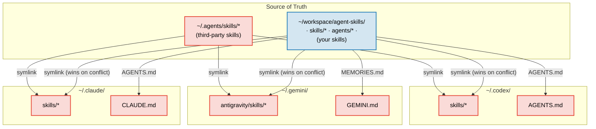
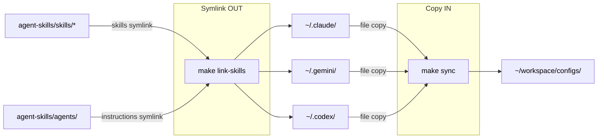

# agent-skills <!-- omit in toc -->

[](#)
[](#)
[](#)
[](#)
[](https://opensource.org/licenses/MIT)

> [!NOTE]
> My personal and public agent skills. [Olshansky.info](https://olshansky.info)

## What is this? <!-- omit in toc -->

- Olshansky's day-to-day agent skills
- Follows the [Agent Skills](https://agentskills.io/home) pattern for cross-tool skill distribution
- Inspired by [vercel-labs/agent-skills](https://github.com/vercel-labs/agent-skills)

## Table of Contents <!-- omit in toc -->

- [Quickstart](#quickstart)
- [Available Skills](#available-skills)
  - [Polished Skills](#polished-skills)
  - [Personal Skills (`cmd-*`)](#personal-skills-cmd-)
  - [3rd Party Skills](#3rd-party-skills)
  - [gstack Collection](#gstack-collection)
- [Star History](#star-history)
- [Demo of `cmd-skills-dashboard`](#demo-of-cmd-skills-dashboard)
- [How It Works](#how-it-works)

## Quickstart

```bash
npx skills add olshansk/agent-skills
```

Then ask your agent to run any installed skill:

- _"resolve merge conflicts"_
- _"close the loop on this session"_
- _"idiot proof the documentation"_
- _"generate skills dashboard"_

> [!TIP]
> Start with [`cmd-session-commit`](skills/cmd-session-commit/SKILL.md) — it turns every coding session into durable knowledge by extracting patterns, decisions, and gotchas into your `AGENTS.md`. Future sessions (and future agents) pick up right where you left off.

## Available Skills

### Polished Skills

Skills I've polished for public use.

| Skill                                                          | What it does                                                  | Trigger examples                                           |
| -------------------------------------------------------------- | ------------------------------------------------------------- | ---------------------------------------------------------- |
| [`cmd-session-commit`](skills/cmd-session-commit/SKILL.md)     | Captures session learnings and updates `AGENTS.md` safely     | "run session commit", "close the loop", "update AGENTS.md" |
| [`cmd-skills-dashboard`](skills/cmd-skills-dashboard/SKILL.md) | Scrapes skills.sh and generates an interactive HTML dashboard | "generate skills dashboard", "show skills ecosystem"       |

### Personal Skills (`cmd-*`)

Skills I use daily but might rename or delete in the future. I prefix them with `cmd-` so I can easily also leverage them as custom slash commands in claude code.

| Skill                                                                    | Description                                                                                                                                             |
| ------------------------------------------------------------------------ | ------------------------------------------------------------------------------------------------------------------------------------------------------- |
| [`cmd-agent-persona-set`](skills/cmd-agent-persona-set/SKILL.md)         | Prime the agent with a behavioral persona for the conversation                                                                                          |
| [`cmd-code-what`](skills/cmd-code-what/SKILL.md)                         | Catch the user up on session activity in 3-5 ultra-tight `**label**: explanation` bullets                                                               |
| [`cmd-codex-review-plan`](skills/cmd-codex-review-plan/SKILL.md)         | Get a second-opinion plan review from Codex (`codex exec`) before exiting plan mode                                                                     |
| [`cmd-codex-review-unstaged`](skills/cmd-codex-review-unstaged/SKILL.md) | Have Codex review the working-tree diff and synthesize a prioritized iteration plan                                                                     |
| [`cmd-docs-idiot-proof`](skills/cmd-docs-idiot-proof/SKILL.md)           | Simplify documentation for clarity and scannability with approval-gated edits                                                                           |
| [`cmd-email-md`](skills/cmd-email-md/SKILL.md)                           | Convert markdown to email-safe HTML with inline styles and cross-client compatibility                                                                   |
| [`cmd-gh-issue`](skills/cmd-gh-issue/SKILL.md)                           | Create structured GitHub issues from conversation context using `gh` CLI                                                                                |
| [`cmd-golden-tests`](skills/cmd-golden-tests/SKILL.md)                   | Set up or extend golden/snapshot tests: fixture design, Makefile targets, snapshot storage, diff workflow, and update protocol                          |
| [`cmd-latest-msg`](skills/cmd-latest-msg/SKILL.md)                       | Store or retrieve the latest agent message to `/tmp/agents/{agent}/`                                                                                    |
| [`cmd-makefile`](skills/cmd-makefile/SKILL.md)                           | Create or improve Makefiles with templates (python-uv, fastapi, nodejs, go, flutter)                                                                    |
| [`cmd-mermaid-render`](skills/cmd-mermaid-render/SKILL.md)               | Render and display Mermaid diagrams inline in iTerm2 or Ghostty                                                                                         |
| [`cmd-olshanskify`](skills/cmd-olshanskify/SKILL.md)                     | Apply Olshansky's personal style to docs, code, blog posts, or presentations via templates                                                              |
| [`cmd-plan-store`](skills/cmd-plan-store/SKILL.md)                       | Capture conversation plans, decisions, and action items into structured markdown in `plans/`                                                            |
| [`cmd-pr-build-context`](skills/cmd-pr-build-context/SKILL.md)           | Build high-signal PR context with diff analysis, risk assessment, and discussion questions                                                              |
| [`cmd-pr-conflict-resolver`](skills/cmd-pr-conflict-resolver/SKILL.md)   | Resolve merge conflicts with context-aware 3-tier classification and escalation                                                                         |
| [`cmd-pr-description`](skills/cmd-pr-description/SKILL.md)               | Generate concise PR descriptions by analyzing the diff against a base branch                                                                            |
| [`cmd-pr-edgecase`](skills/cmd-pr-edgecase/SKILL.md)                     | Review branch changes for test gaps, logic edge cases, and failure modes                                                                                |
| [`cmd-pr-follow-up`](skills/cmd-pr-follow-up/SKILL.md)                   | Post-implementation reflection — surface missed work, simplifications, and idiomatic fixes                                                              |
| [`cmd-pr-gh-comments`](skills/cmd-pr-gh-comments/SKILL.md)               | Holistically triage PR comments with line-range context, adjacent sweeps, approval-gated resolution, and cmd-olshanskify updates for @olshansk feedback |
| [`cmd-pr-review-prepare`](skills/cmd-pr-review-prepare/SKILL.md)         | Prepare branch for code review by building context and identifying issues                                                                               |
| [`cmd-pr-scope-sweep`](skills/cmd-pr-scope-sweep/SKILL.md)               | Final pass to identify missed items, edge cases, and risks before closing scope                                                                         |
| [`cmd-pr-sculpt-code`](skills/cmd-pr-sculpt-code/SKILL.md)               | Reshape code for readability, naming, structure, TODOs, and reduced surface area                                                                        |
| [`cmd-pr-test-plan`](skills/cmd-pr-test-plan/SKILL.md)                   | Generate manual test plans with verified commands and pass/fail criteria                                                                                |
| [`cmd-productionize`](skills/cmd-productionize/SKILL.md)                 | Transform apps into production-ready deployments with framework-specific optimization                                                                   |
| [`cmd-review-chain-halt`](skills/cmd-review-chain-halt/SKILL.md)         | Review protocol code for chain halt risks, non-determinism, and onchain behavior bugs                                                                   |
| [`cmd-review-rfc`](skills/cmd-review-rfc/SKILL.md)                       | Review RFCs for problem clarity, compliance, security, and performance using SCQA                                                                       |
| [`cmd-skills-local-repo`](skills/cmd-skills-local-repo/SKILL.md)         | Scaffold cross-tool repo-local skills with canonical source in `.agents/skills/` and symlinks                                                           |
| [`cmd-write-proofread`](skills/cmd-write-proofread/SKILL.md)             | Proofread posts for spelling, grammar, repetition, logic, weak arguments, and broken links                                                              |

### 3rd Party Skills

Skills installed from other publishers via `npx skills add`. These live in `~/.agents/skills/` and are not authored in this repo. Regenerate both tables below with `make sync-external-skills`.

<!-- BEGIN: 3rd-party-skills -->

| Skill                         | Description                                                                                                                                                                                                                                                                                                                                                                                                                                                                       |
| ----------------------------- | --------------------------------------------------------------------------------------------------------------------------------------------------------------------------------------------------------------------------------------------------------------------------------------------------------------------------------------------------------------------------------------------------------------------------------------------------------------------------------- |
| `open-gstack-browser`         | Launch GStack Browser — AI-controlled Chromium with the sidebar extension baked in. Opens a visible browser window where you can watch every action in real time. The sidebar shows a live activity feed and chat. Anti-bot stealth built in. Use when asked to "open gstack browser", "launch browser", "connect chrome", "open chrome", "real browser", "launch chrome", "side panel", or "control my browser". Voice triggers (speech-to-text aliases): "show me the browser". |
| `find-skills`                 | Helps users discover and install agent skills when they ask questions like "how do I do X", "find a skill for X", "is there a skill that can...", or express interest in extending capabilities. This skill should be used when the user is looking for functionality that might exist as an installable skill.                                                                                                                                                                   |
| `grove`                       | Grove is a wallet-first, agent-friendly Linktree that helps creators earn revenue from high-quality content online. Covers wallet setup, identity/handle registration, creator discovery, crypto tipping, paid messaging (Tip to Talk), content feed discovery, stream alerts, and earning. Use when the user wants to tip, pay, message, or attribute value to a creator, set up a web3 profile, discover content, or monetize content and attention.                            |
| `gstack-upgrade`              | Upgrade gstack to the latest version. Detects global vs vendored install, runs the upgrade, and shows what's new. Use when asked to "upgrade gstack", "update gstack", or "get latest version". Voice triggers (speech-to-text aliases): "upgrade the tools", "update the tools", "gee stack upgrade", "g stack upgrade".                                                                                                                                                         |
| `learn`                       | Manage project learnings. Review, search, prune, and export what gstack has learned across sessions. Use when asked to "what have we learned", "show learnings", "prune stale learnings", or "export learnings". Proactively suggest when the user asks about past patterns or wonders "didn't we fix this before?"                                                                                                                                                               |
| `macos-design-guidelines`     | Apple Human Interface Guidelines for Mac. Use when building macOS apps with SwiftUI or AppKit, implementing menu bars, toolbars, window management, or keyboard shortcuts. Triggers on tasks involving Mac UI, desktop apps, or Mac Catalyst.                                                                                                                                                                                                                                     |
| `native-app-performance`      | Native macOS/iOS app performance profiling via xctrace/Time Profiler and CLI-only analysis of Instruments traces. Use when asked to profile, attach, record, or analyze Instruments .trace files, find hotspots, or optimize native app performance without opening Instruments UI.                                                                                                                                                                                               |
| `setup-deploy`                | Configure deployment settings for /land-and-deploy. Detects your deploy platform (Fly.io, Render, Vercel, Netlify, Heroku, GitHub Actions, custom), production URL, health check endpoints, and deploy status commands. Writes the configuration to CLAUDE.md so all future deploys are automatic. Use when: "setup deploy", "configure deployment", "set up land-and-deploy", "how do I deploy with gstack", "add deploy config".                                                |
| `skill-creator`               | Create new skills, modify and improve existing skills, and measure skill performance. Use when users want to create a skill from scratch, update or optimize an existing skill, run evals to test a skill, benchmark skill performance with variance analysis, or optimize a skill's description for better triggering accuracy.                                                                                                                                                  |
| `swift-accessibility`         | Automatically applies accessibility best practices to Swift projects (SwiftUI and UIKit). Use when working on iOS/macOS projects that need VoiceOver support, Dynamic Type, WCAG compliance, or accessibility audits. Triggers on Swift accessibility tasks, a11y improvements, or when the user mentions accessibility, VoiceOver, or Dynamic Type.                                                                                                                              |
| `swiftui-developer`           | Develop SwiftUI applications for iOS/macOS. Use when writing SwiftUI views, managing state, or building Apple platform UIs.                                                                                                                                                                                                                                                                                                                                                       |
| `vercel-composition-patterns` | React composition patterns that scale. Use when refactoring components with boolean prop proliferation, building flexible component libraries, or designing reusable APIs. Triggers on tasks involving compound components, render props, context providers, or component architecture. Includes React 19 API changes.                                                                                                                                                            |
| `vercel-react-best-practices` | React and Next.js performance optimization guidelines from Vercel Engineering. This skill should be used when writing, reviewing, or refactoring React/Next.js code to ensure optimal performance patterns. Triggers on tasks involving React components, Next.js pages, data fetching, bundle optimization, or performance improvements.                                                                                                                                         |
| `vercel-react-native-skills`  | React Native and Expo best practices for building performant mobile apps. Use when building React Native components, optimizing list performance, implementing animations, or working with native modules. Triggers on tasks involving React Native, Expo, mobile performance, or native platform APIs.                                                                                                                                                                           |
| `web-design-guidelines`       | Review UI code for Web Interface Guidelines compliance. Use when asked to "review my UI", "check accessibility", "audit design", "review UX", or "check my site against best practices".                                                                                                                                                                                                                                                                                          |
| `xcode-build`                 | Build and run iOS/macOS apps using xcodebuild and xcrun simctl directly. Use when building Xcode projects, running iOS simulators, managing devices, compiling Swift code, running UI tests, or automating iOS app interactions. Replaces XcodeBuildMCP with native CLI tools.                                                                                                                                                                                                    |

<!-- END: 3rd-party-skills -->

### gstack Collection

Skills from the [gstack](https://gstack.dev) publisher (descriptions tagged `(gstack)`). Auto-populated by `make sync-external-skills`.

<!-- BEGIN: gstack-skills -->

| Skill                   | Description                                                                                                                                                                                                                                                                                                                                                                                                                                                                                                                                                                                                                                                                                                                                                                                     |
| ----------------------- | ----------------------------------------------------------------------------------------------------------------------------------------------------------------------------------------------------------------------------------------------------------------------------------------------------------------------------------------------------------------------------------------------------------------------------------------------------------------------------------------------------------------------------------------------------------------------------------------------------------------------------------------------------------------------------------------------------------------------------------------------------------------------------------------------- |
| `autoplan`              | Auto-review pipeline — reads the full CEO, design, eng, and DX review skills from disk and runs them sequentially with auto-decisions using 6 decision principles. Surfaces taste decisions (close approaches, borderline scope, codex disagreements) at a final approval gate. One command, fully reviewed plan out. Use when asked to "auto review", "autoplan", "run all reviews", "review this plan automatically", or "make the decisions for me". Proactively suggest when the user has a plan file and wants to run the full review gauntlet without answering 15-30 intermediate questions. (gstack) Voice triggers (speech-to-text aliases): "auto plan", "automatic review".                                                                                                          |
| `benchmark`             | Performance regression detection using the browse daemon. Establishes baselines for page load times, Core Web Vitals, and resource sizes. Compares before/after on every PR. Tracks performance trends over time. Use when: "performance", "benchmark", "page speed", "lighthouse", "web vitals", "bundle size", "load time". (gstack) Voice triggers (speech-to-text aliases): "speed test", "check performance".                                                                                                                                                                                                                                                                                                                                                                              |
| `benchmark-models`      | Cross-model benchmark for gstack skills. Runs the same prompt through Claude, GPT (via Codex CLI), and Gemini side-by-side — compares latency, tokens, cost, and optionally quality via LLM judge. Answers "which model is actually best for this skill?" with data instead of vibes. Separate from /benchmark, which measures web page performance. Use when: "benchmark models", "compare models", "which model is best for X", "cross-model comparison", "model shootout". (gstack) Voice triggers (speech-to-text aliases): "compare models", "model shootout", "which model is best".                                                                                                                                                                                                      |
| `browse`                | Fast headless browser for QA testing and site dogfooding. Navigate any URL, interact with elements, verify page state, diff before/after actions, take annotated screenshots, check responsive layouts, test forms and uploads, handle dialogs, and assert element states. ~100ms per command. Use when you need to test a feature, verify a deployment, dogfood a user flow, or file a bug with evidence. Use when asked to "open in browser", "test the site", "take a screenshot", or "dogfood this". (gstack)                                                                                                                                                                                                                                                                               |
| `canary`                | Post-deploy canary monitoring. Watches the live app for console errors, performance regressions, and page failures using the browse daemon. Takes periodic screenshots, compares against pre-deploy baselines, and alerts on anomalies. Use when: "monitor deploy", "canary", "post-deploy check", "watch production", "verify deploy". (gstack)                                                                                                                                                                                                                                                                                                                                                                                                                                                |
| `careful`               | Safety guardrails for destructive commands. Warns before rm -rf, DROP TABLE, force-push, git reset --hard, kubectl delete, and similar destructive operations. User can override each warning. Use when touching prod, debugging live systems, or working in a shared environment. Use when asked to "be careful", "safety mode", "prod mode", or "careful mode". (gstack)                                                                                                                                                                                                                                                                                                                                                                                                                      |
| `codex`                 | OpenAI Codex CLI wrapper — three modes. Code review: independent diff review via codex review with pass/fail gate. Challenge: adversarial mode that tries to break your code. Consult: ask codex anything with session continuity for follow-ups. The "200 IQ autistic developer" second opinion. Use when asked to "codex review", "codex challenge", "ask codex", "second opinion", or "consult codex". (gstack) Voice triggers (speech-to-text aliases): "code x", "code ex", "get another opinion".                                                                                                                                                                                                                                                                                         |
| `context-restore`       | Restore working context saved earlier by /context-save. Loads the most recent saved state (across all branches by default) so you can pick up where you left off — even across Conductor workspace handoffs. Use when asked to "resume", "restore context", "where was I", or "pick up where I left off". Pair with /context-save. Formerly /checkpoint resume — renamed because Claude Code treats /checkpoint as a native rewind alias in current environments. (gstack)                                                                                                                                                                                                                                                                                                                      |
| `context-save`          | Save working context. Captures git state, decisions made, and remaining work so any future session can pick up without losing a beat. Use when asked to "save progress", "save state", "context save", or "save my work". Pair with /context-restore to resume later. Formerly /checkpoint — renamed because Claude Code treats /checkpoint as a native rewind alias in current environments, which was shadowing this skill. (gstack)                                                                                                                                                                                                                                                                                                                                                          |
| `cso`                   | Chief Security Officer mode. Infrastructure-first security audit: secrets archaeology, dependency supply chain, CI/CD pipeline security, LLM/AI security, skill supply chain scanning, plus OWASP Top 10, STRIDE threat modeling, and active verification. Two modes: daily (zero-noise, 8/10 confidence gate) and comprehensive (monthly deep scan, 2/10 bar). Trend tracking across audit runs. Use when: "security audit", "threat model", "pentest review", "OWASP", "CSO review". (gstack) Voice triggers (speech-to-text aliases): "see-so", "see so", "security review", "security check", "vulnerability scan", "run security".                                                                                                                                                         |
| `design-consultation`   | Design consultation: understands your product, researches the landscape, proposes a complete design system (aesthetic, typography, color, layout, spacing, motion), and generates font+color preview pages. Creates DESIGN.md as your project's design source of truth. For existing sites, use /plan-design-review to infer the system instead. Use when asked to "design system", "brand guidelines", or "create DESIGN.md". Proactively suggest when starting a new project's UI with no existing design system or DESIGN.md. (gstack)                                                                                                                                                                                                                                                       |
| `design-html`           | Design finalization: generates production-quality Pretext-native HTML/CSS. Works with approved mockups from /design-shotgun, CEO plans from /plan-ceo-review, design review context from /plan-design-review, or from scratch with a user description. Text actually reflows, heights are computed, layouts are dynamic. 30KB overhead, zero deps. Smart API routing: picks the right Pretext patterns for each design type. Use when: "finalize this design", "turn this into HTML", "build me a page", "implement this design", or after any planning skill. Proactively suggest when user has approved a design or has a plan ready. (gstack) Voice triggers (speech-to-text aliases): "build the design", "code the mockup", "make it real".                                                |
| `design-review`         | Designer's eye QA: finds visual inconsistency, spacing issues, hierarchy problems, AI slop patterns, and slow interactions — then fixes them. Iteratively fixes issues in source code, committing each fix atomically and re-verifying with before/after screenshots. For plan-mode design review (before implementation), use /plan-design-review. Use when asked to "audit the design", "visual QA", "check if it looks good", or "design polish". Proactively suggest when the user mentions visual inconsistencies or wants to polish the look of a live site. (gstack)                                                                                                                                                                                                                     |
| `design-shotgun`        | Design shotgun: generate multiple AI design variants, open a comparison board, collect structured feedback, and iterate. Standalone design exploration you can run anytime. Use when: "explore designs", "show me options", "design variants", "visual brainstorm", or "I don't like how this looks". Proactively suggest when the user describes a UI feature but hasn't seen what it could look like. (gstack)                                                                                                                                                                                                                                                                                                                                                                                |
| `devex-review`          | Live developer experience audit. Uses the browse tool to actually TEST the developer experience: navigates docs, tries the getting started flow, times TTHW, screenshots error messages, evaluates CLI help text. Produces a DX scorecard with evidence. Compares against /plan-devex-review scores if they exist (the boomerang: plan said 3 minutes, reality says 8). Use when asked to "test the DX", "DX audit", "developer experience test", or "try the onboarding". Proactively suggest after shipping a developer-facing feature. (gstack) Voice triggers (speech-to-text aliases): "dx audit", "test the developer experience", "try the onboarding", "developer experience test".                                                                                                     |
| `document-release`      | Post-ship documentation update. Reads all project docs, cross-references the diff, updates README/ARCHITECTURE/CONTRIBUTING/CLAUDE.md to match what shipped, polishes CHANGELOG voice, cleans up TODOS, and optionally bumps VERSION. Use when asked to "update the docs", "sync documentation", or "post-ship docs". Proactively suggest after a PR is merged or code is shipped. (gstack)                                                                                                                                                                                                                                                                                                                                                                                                     |
| `freeze`                | Restrict file edits to a specific directory for the session. Blocks Edit and Write outside the allowed path. Use when debugging to prevent accidentally "fixing" unrelated code, or when you want to scope changes to one module. Use when asked to "freeze", "restrict edits", "only edit this folder", or "lock down edits". (gstack)                                                                                                                                                                                                                                                                                                                                                                                                                                                         |
| `gstack`                | Fast headless browser for QA testing and site dogfooding. Navigate pages, interact with elements, verify state, diff before/after, take annotated screenshots, test responsive layouts, forms, uploads, dialogs, and capture bug evidence. Use when asked to open or test a site, verify a deployment, dogfood a user flow, or file a bug with screenshots. (gstack)                                                                                                                                                                                                                                                                                                                                                                                                                            |
| `guard`                 | Full safety mode: destructive command warnings + directory-scoped edits. Combines /careful (warns before rm -rf, DROP TABLE, force-push, etc.) with /freeze (blocks edits outside a specified directory). Use for maximum safety when touching prod or debugging live systems. Use when asked to "guard mode", "full safety", "lock it down", or "maximum safety". (gstack)                                                                                                                                                                                                                                                                                                                                                                                                                     |
| `health`                | Code quality dashboard. Wraps existing project tools (type checker, linter, test runner, dead code detector, shell linter), computes a weighted composite 0-10 score, and tracks trends over time. Use when: "health check", "code quality", "how healthy is the codebase", "run all checks", "quality score". (gstack)                                                                                                                                                                                                                                                                                                                                                                                                                                                                         |
| `investigate`           | Systematic debugging with root cause investigation. Four phases: investigate, analyze, hypothesize, implement. Iron Law: no fixes without root cause. Use when asked to "debug this", "fix this bug", "why is this broken", "investigate this error", or "root cause analysis". Proactively invoke this skill (do NOT debug directly) when the user reports errors, 500 errors, stack traces, unexpected behavior, "it was working yesterday", or is troubleshooting why something stopped working. (gstack)                                                                                                                                                                                                                                                                                    |
| `land-and-deploy`       | Land and deploy workflow. Merges the PR, waits for CI and deploy, verifies production health via canary checks. Takes over after /ship creates the PR. Use when: "merge", "land", "deploy", "merge and verify", "land it", "ship it to production". (gstack)                                                                                                                                                                                                                                                                                                                                                                                                                                                                                                                                    |
| `landing-report`        | Read-only queue dashboard for workspace-aware ship. Shows which VERSION slots are currently claimed by open PRs, which sibling Conductor workspaces have WIP work likely to ship soon, and what slot /ship would pick next. No mutations — just a snapshot. Use when asked to "landing report", "what's in the queue", "show me open PRs", or "which version do I claim next". (gstack)                                                                                                                                                                                                                                                                                                                                                                                                         |
| `make-pdf`              | Turn any markdown file into a publication-quality PDF. Proper 1in margins, intelligent page breaks, page numbers, cover pages, running headers, curly quotes and em dashes, clickable TOC, diagonal DRAFT watermark. Not a draft artifact — a finished artifact. Use when asked to "make a PDF", "export to PDF", "turn this markdown into a PDF", or "generate a document". (gstack) Voice triggers (speech-to-text aliases): "make this a pdf", "make it a pdf", "export to pdf", "turn this into a pdf", "turn this markdown into a pdf", "generate a pdf", "make a pdf from", "pdf this markdown".                                                                                                                                                                                          |
| `office-hours`          | YC Office Hours — two modes. Startup mode: six forcing questions that expose demand reality, status quo, desperate specificity, narrowest wedge, observation, and future-fit. Builder mode: design thinking brainstorming for side projects, hackathons, learning, and open source. Saves a design doc. Use when asked to "brainstorm this", "I have an idea", "help me think through this", "office hours", or "is this worth building". Proactively invoke this skill (do NOT answer directly) when the user describes a new product idea, asks whether something is worth building, wants to think through design decisions for something that doesn't exist yet, or is exploring a concept before any code is written. Use before /plan-ceo-review or /plan-eng-review. (gstack)            |
| `pair-agent`            | Pair a remote AI agent with your browser. One command generates a setup key and prints instructions the other agent can follow to connect. Works with OpenClaw, Hermes, Codex, Cursor, or any agent that can make HTTP requests. The remote agent gets its own tab with scoped access (read+write by default, admin on request). Use when asked to "pair agent", "connect agent", "share browser", "remote browser", "let another agent use my browser", or "give browser access". (gstack) Voice triggers (speech-to-text aliases): "pair agent", "connect agent", "share my browser", "remote browser access".                                                                                                                                                                                |
| `plan-ceo-review`       | CEO/founder-mode plan review. Rethink the problem, find the 10-star product, challenge premises, expand scope when it creates a better product. Four modes: SCOPE EXPANSION (dream big), SELECTIVE EXPANSION (hold scope + cherry-pick expansions), HOLD SCOPE (maximum rigor), SCOPE REDUCTION (strip to essentials). Use when asked to "think bigger", "expand scope", "strategy review", "rethink this", or "is this ambitious enough". Proactively suggest when the user is questioning scope or ambition of a plan, or when the plan feels like it could be thinking bigger. (gstack)                                                                                                                                                                                                      |
| `plan-design-review`    | Designer's eye plan review — interactive, like CEO and Eng review. Rates each design dimension 0-10, explains what would make it a 10, then fixes the plan to get there. Works in plan mode. For live site visual audits, use /design-review. Use when asked to "review the design plan" or "design critique". Proactively suggest when the user has a plan with UI/UX components that should be reviewed before implementation. (gstack)                                                                                                                                                                                                                                                                                                                                                       |
| `plan-devex-review`     | Interactive developer experience plan review. Explores developer personas, benchmarks against competitors, designs magical moments, and traces friction points before scoring. Three modes: DX EXPANSION (competitive advantage), DX POLISH (bulletproof every touchpoint), DX TRIAGE (critical gaps only). Use when asked to "DX review", "developer experience audit", "devex review", or "API design review". Proactively suggest when the user has a plan for developer-facing products (APIs, CLIs, SDKs, libraries, platforms, docs). (gstack) Voice triggers (speech-to-text aliases): "dx review", "developer experience review", "devex review", "devex audit", "API design review", "onboarding review".                                                                              |
| `plan-eng-review`       | Eng manager-mode plan review. Lock in the execution plan — architecture, data flow, diagrams, edge cases, test coverage, performance. Walks through issues interactively with opinionated recommendations. Use when asked to "review the architecture", "engineering review", or "lock in the plan". Proactively suggest when the user has a plan or design doc and is about to start coding — to catch architecture issues before implementation. (gstack) Voice triggers (speech-to-text aliases): "tech review", "technical review", "plan engineering review".                                                                                                                                                                                                                              |
| `plan-tune`             | Self-tuning question sensitivity + developer psychographic for gstack (v1: observational). Review which AskUserQuestion prompts fire across gstack skills, set per-question preferences (never-ask / always-ask / ask-only-for-one-way), inspect the dual-track profile (what you declared vs what your behavior suggests), and enable/disable question tuning. Conversational interface — no CLI syntax required. Use when asked to "tune questions", "stop asking me that", "too many questions", "show my profile", "what questions have I been asked", "show my vibe", "developer profile", or "turn off question tuning". (gstack) Proactively suggest when the user says the same gstack question has come up before, or when they explicitly override a recommendation for the Nth time. |
| `qa`                    | Systematically QA test a web application and fix bugs found. Runs QA testing, then iteratively fixes bugs in source code, committing each fix atomically and re-verifying. Use when asked to "qa", "QA", "test this site", "find bugs", "test and fix", or "fix what's broken". Proactively suggest when the user says a feature is ready for testing or asks "does this work?". Three tiers: Quick (critical/high only), Standard (+ medium), Exhaustive (+ cosmetic). Produces before/after health scores, fix evidence, and a ship-readiness summary. For report-only mode, use /qa-only. (gstack) Voice triggers (speech-to-text aliases): "quality check", "test the app", "run QA".                                                                                                       |
| `qa-only`               | Report-only QA testing. Systematically tests a web application and produces a structured report with health score, screenshots, and repro steps — but never fixes anything. Use when asked to "just report bugs", "qa report only", or "test but don't fix". For the full test-fix-verify loop, use /qa instead. Proactively suggest when the user wants a bug report without any code changes. (gstack) Voice triggers (speech-to-text aliases): "bug report", "just check for bugs".                                                                                                                                                                                                                                                                                                          |
| `retro`                 | Weekly engineering retrospective. Analyzes commit history, work patterns, and code quality metrics with persistent history and trend tracking. Team-aware: breaks down per-person contributions with praise and growth areas. Use when asked to "weekly retro", "what did we ship", or "engineering retrospective". Proactively suggest at the end of a work week or sprint. (gstack)                                                                                                                                                                                                                                                                                                                                                                                                           |
| `review`                | Pre-landing PR review. Analyzes diff against the base branch for SQL safety, LLM trust boundary violations, conditional side effects, and other structural issues. Use when asked to "review this PR", "code review", "pre-landing review", or "check my diff". Proactively suggest when the user is about to merge or land code changes. (gstack)                                                                                                                                                                                                                                                                                                                                                                                                                                              |
| `setup-browser-cookies` | Import cookies from your real Chromium browser into the headless browse session. Opens an interactive picker UI where you select which cookie domains to import. Use before QA testing authenticated pages. Use when asked to "import cookies", "login to the site", or "authenticate the browser". (gstack)                                                                                                                                                                                                                                                                                                                                                                                                                                                                                    |
| `setup-gbrain`          | Set up gbrain for this coding agent: install the CLI, initialize a local PGLite or Supabase brain, register MCP, capture per-remote trust policy. One command from zero to "gbrain is running, and this agent can call it." Use when: "setup gbrain", "connect gbrain", "start gbrain", "install gbrain", "configure gbrain for this machine". (gstack)                                                                                                                                                                                                                                                                                                                                                                                                                                         |
| `ship`                  | Ship workflow: detect + merge base branch, run tests, review diff, bump VERSION, update CHANGELOG, commit, push, create PR. Use when asked to "ship", "deploy", "push to main", "create a PR", "merge and push", or "get it deployed". Proactively invoke this skill (do NOT push/PR directly) when the user says code is ready, asks about deploying, wants to push code up, or asks to create a PR. (gstack)                                                                                                                                                                                                                                                                                                                                                                                  |
| `unfreeze`              | Clear the freeze boundary set by /freeze, allowing edits to all directories again. Use when you want to widen edit scope without ending the session. Use when asked to "unfreeze", "unlock edits", "remove freeze", or "allow all edits". (gstack)                                                                                                                                                                                                                                                                                                                                                                                                                                                                                                                                              |

<!-- END: gstack-skills -->

## Star History

[](https://www.star-history.com/#olshansk/agent-skills&type=date&legend=top-left)

## Demo of `cmd-skills-dashboard`

A live dashboard of the skills.sh ecosystem is available at **[skills-dashboard.olshansky.info](https://skills-dashboard.olshansky.info/)**.

It shows publisher distribution, install counts, top skills, and the long-tail power law of adoption. Regenerate it yourself with the `cmd-skills-dashboard` skill.


## How It Works

### Symlink Architecture <!-- omit in toc -->

Two sources of truth feed into every tool's skills directory:



| Skill type      | Source of truth       | Installed via      | Symlink target                      |
| --------------- | --------------------- | ------------------ | ----------------------------------- |
| **Your skills** | `skills/` (this repo) | `make link-skills` | `~/workspace/agent-skills/skills/*` |
| **Third-party** | `~/.agents/skills/`   | `npx skills add`   | `~/.agents/skills/*`                |

### Makefile Workflows <!-- omit in toc -->



| Target             | Description                                                      |
| ------------------ | ---------------------------------------------------------------- |
| `make link-skills` | Symlink repo + third-party skills into Claude, Gemini, and Codex |
| `make list-skills` | List all skills with descriptions                                |
| `make sync`        | Backup tool configs into `~/workspace/configs/`                  |
| `make test`        | Validate skill frontmatter and repo consistency                  |

### After `npx skills add` <!-- omit in toc -->

`npx skills add` installs third-party skills into `~/.agents/skills/` and creates symlinks in `~/.claude/skills/`. Running `make link-skills` afterward restores your repo skills (which take precedence on name conflicts) and extends third-party skills to Codex and Gemini.
