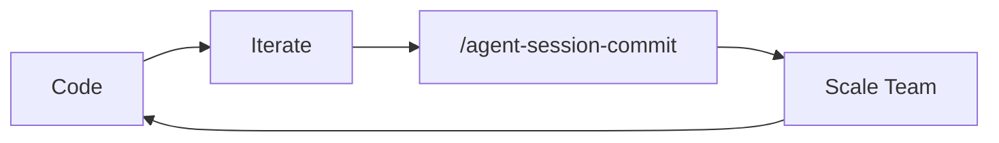

# Agent Session Commit <!-- omit in toc -->

**One command to make your AI assistants share a brain.**

Capture session learnings to `AGENTS.md`—a single source of truth that works across Claude Code, Cursor, Windsurf, and Gemini.



- [Quickstart](#quickstart)
  - [Installation](#installation)
  - [Usage](#usage)
- [Why This Exists](#why-this-exists)
- [What does this plugin do?](#what-does-this-plugin-do)
- [What Gets Captured](#what-gets-captured)

## Quickstart

### Installation

```bash
# Open claude
/claude

# Add the marketplace
/plugin marketplace add olshansk/agent-session-commit

# Install the plugin
/plugin install agent-session-commit@olshansk
```

> [!NOTE]
> After installing, restart Claude Code for the plugin to take effect.

**Update:**

```bash
/plugin update agent-session-commit@cc-marketplace`
```

**Auto-Update:** Run `/plugin` → Select Marketplaces → Choose cc-marketplace → Enable auto-update

### Usage

Run this at the end of a coding session to capture what you learned or best practices you wanto maintain for future session.

```bash
/agent-session-commit
```

## Why This Exists

Every one of your claude sessions likely results in some best practice, pattern, or other tidbit of knowledge that you want to remember for future sessions.

The only to scale or team of human software engineers or fleet of agents is to disseminate best practices.

Best of all, we have `AGENTS.md` for this now!

## What does this plugin do?

1. Reviews existing AGENTS.md to avoid duplicates
2. Analyzes session for valuable learnings
3. Proposes changes with `diff` formatting:
   - Additions in green (`+`)
   - Modifications with before/after
   - Removals in red (`-`)
4. Waits for your confirmation
5. Creates CLAUDE.md/GEMINI.md pointing to AGENTS.md (if missing)
6. Prompts to run `/init` to reload configuration

## What Gets Captured

| Category     | Examples                                |
| ------------ | --------------------------------------- |
| Patterns     | Code style, naming conventions          |
| Architecture | Why things are structured a certain way |
| Gotchas      | Pitfalls discovered during development  |
| Debugging    | What to check when things break         |

## Star History

[](https://www.star-history.com/#Olshansk/agent-session-commit&type=date&legend=top-left)
