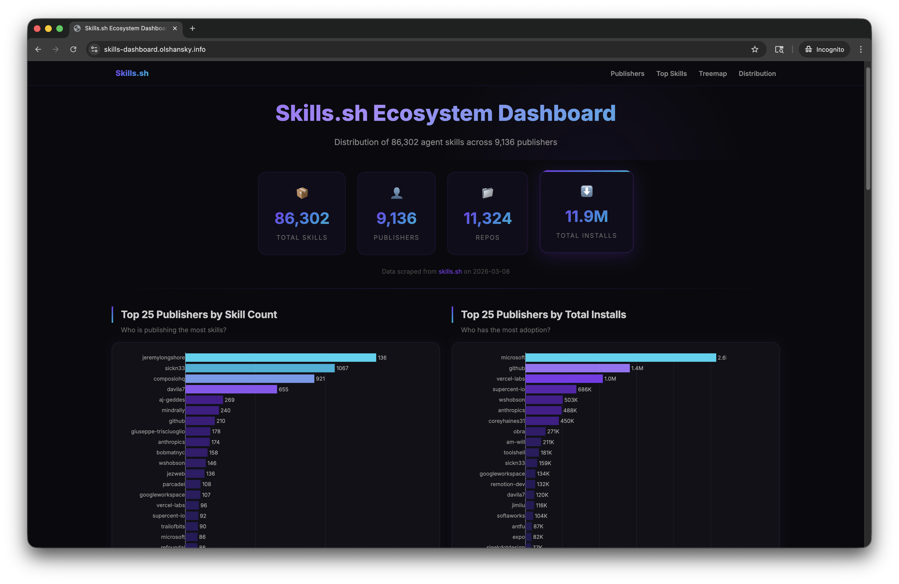
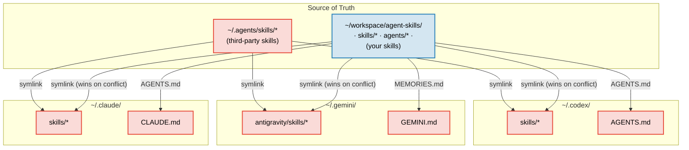
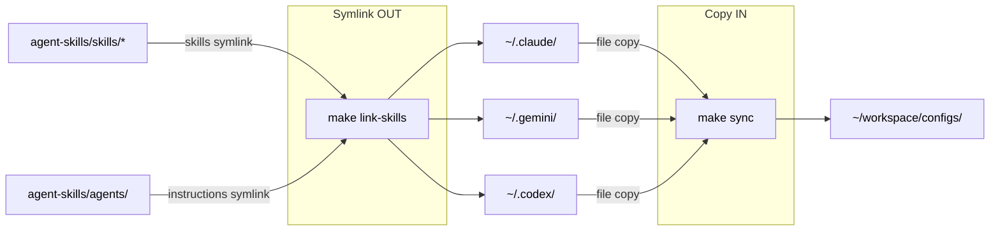

# agent-skills <!-- omit in toc -->

[](#)
[](#)
[](#)
[](#)
[](https://opensource.org/licenses/MIT)

> [!NOTE]
> My personal and public agent skills. [Olshansky.info](https://olshansky.info)

## What is this? <!-- omit in toc -->

- Olshansky's day-to-day agent skills
- Follows the [Agent Skills](https://agentskills.io/home) pattern for cross-tool skill distribution
- Inspired by [vercel-labs/agent-skills](https://github.com/vercel-labs/agent-skills)

## Table of Contents <!-- omit in toc -->

- [Quickstart](#quickstart)
- [Available Skills](#available-skills)
  - [3rd Party Skills](#3rd-party-skills)
- [Star History](#star-history)
- [Demo of `cmd-skills-dashboard`](#demo-of-cmd-skills-dashboard)
- [How It Works](#how-it-works)

## Quickstart

```bash
npx skills add olshansk/agent-skills
```

Then ask your agent to run any installed skill:

- _"resolve merge conflicts"_
- _"close the loop on this session"_
- _"idiot proof the documentation"_
- _"generate skills dashboard"_

> [!TIP]
> Start with [`cmd-session-commit`](skills/cmd-session-commit/SKILL.md) — it turns every coding session into durable knowledge by extracting patterns, decisions, and gotchas into your `AGENTS.md`. Future sessions (and future agents) pick up right where you left off.

## Available Skills

| Skill | Description |
| ----- | ----------- |
| [`cmd-agent-persona-set`](skills/cmd-agent-persona-set/SKILL.md) | Prime the agent with a behavioral persona for the conversation |
| [`cmd-code-what`](skills/cmd-code-what/SKILL.md) | Catch the user up on session activity in 3-5 ultra-tight `**label**: explanation` bullets |
| [`cmd-codex-review-plan`](skills/cmd-codex-review-plan/SKILL.md) | Get a second-opinion plan review from Codex (`codex exec`) before exiting plan mode |
| [`cmd-codex-review-unstaged`](skills/cmd-codex-review-unstaged/SKILL.md) | Have Codex review the working-tree diff and synthesize a prioritized iteration plan |
| [`cmd-docs-idiot-proof`](skills/cmd-docs-idiot-proof/SKILL.md) | Simplify documentation for clarity and scannability with approval-gated edits |
| [`cmd-email-md`](skills/cmd-email-md/SKILL.md) | Convert markdown to email-safe HTML with inline styles and cross-client compatibility |
| [`cmd-gh-issue`](skills/cmd-gh-issue/SKILL.md) | Create structured GitHub issues from conversation context using `gh` CLI |
| [`cmd-golden-tests`](skills/cmd-golden-tests/SKILL.md) | Set up or extend golden/snapshot tests: fixture design, Makefile targets, snapshot storage, diff workflow, and update protocol |
| [`cmd-latest-msg`](skills/cmd-latest-msg/SKILL.md) | Store or retrieve the latest agent message to `/tmp/agents/{agent}/` |
| [`cmd-makefile`](skills/cmd-makefile/SKILL.md) | Create or improve Makefiles with templates (python-uv, fastapi, nodejs, go, flutter) |
| [`cmd-mermaid-render`](skills/cmd-mermaid-render/SKILL.md) | Render and display Mermaid diagrams inline in iTerm2 or Ghostty |
| [`cmd-olshanskify`](skills/cmd-olshanskify/SKILL.md) | Apply Olshansky's personal style to docs, code, blog posts, or presentations via templates |
| [`cmd-plan-store`](skills/cmd-plan-store/SKILL.md) | Capture conversation plans, decisions, and action items into structured markdown in `plans/` |
| [`cmd-pr-build-context`](skills/cmd-pr-build-context/SKILL.md) | Build high-signal PR context with diff analysis, risk assessment, and discussion questions |
| [`cmd-pr-conflict-resolver`](skills/cmd-pr-conflict-resolver/SKILL.md) | Resolve merge conflicts with context-aware 3-tier classification and escalation |
| [`cmd-pr-description`](skills/cmd-pr-description/SKILL.md) | Generate concise PR descriptions by analyzing the diff against a base branch |
| [`cmd-pr-edgecase`](skills/cmd-pr-edgecase/SKILL.md) | Review branch changes for test gaps, logic edge cases, and failure modes |
| [`cmd-pr-follow-up`](skills/cmd-pr-follow-up/SKILL.md) | Post-implementation reflection — surface missed work, simplifications, and idiomatic fixes |
| [`cmd-pr-gh-comments`](skills/cmd-pr-gh-comments/SKILL.md) | Holistically triage PR comments with line-range context, adjacent sweeps, approval-gated resolution, and cmd-olshanskify updates for @olshansk feedback |
| [`cmd-pr-review-prepare`](skills/cmd-pr-review-prepare/SKILL.md) | Prepare branch for code review by building context and identifying issues |
| [`cmd-pr-scope-sweep`](skills/cmd-pr-scope-sweep/SKILL.md) | Final pass to identify missed items, edge cases, and risks before closing scope |
| [`cmd-pr-sculpt-code`](skills/cmd-pr-sculpt-code/SKILL.md) | Reshape code for readability, naming, structure, TODOs, and reduced surface area |
| [`cmd-pr-test-plan`](skills/cmd-pr-test-plan/SKILL.md) | Generate manual test plans with verified commands and pass/fail criteria |
| [`cmd-productionize`](skills/cmd-productionize/SKILL.md) | Transform apps into production-ready deployments with framework-specific optimization |
| [`cmd-review-chain-halt`](skills/cmd-review-chain-halt/SKILL.md) | Review protocol code for chain halt risks, non-determinism, and onchain behavior bugs |
| [`cmd-review-rfc`](skills/cmd-review-rfc/SKILL.md) | Review RFCs for problem clarity, compliance, security, and performance using SCQA |
| [`cmd-session-commit`](skills/cmd-session-commit/SKILL.md) | Capture session learnings and update `AGENTS.md` safely |
| [`cmd-skills-dashboard`](skills/cmd-skills-dashboard/SKILL.md) | Scrape skills.sh and generate an interactive HTML dashboard of the ecosystem |
| [`cmd-skills-local-repo`](skills/cmd-skills-local-repo/SKILL.md) | Scaffold cross-tool repo-local skills with canonical source in `.agents/skills/` and symlinks |
| [`cmd-skills-review`](skills/cmd-skills-review/SKILL.md) | Audit personal skills for redundancy, verbosity, and weak triggers via a Claude→Codex loop with approval-gated edits |
| [`cmd-write-proofread`](skills/cmd-write-proofread/SKILL.md) | Proofread posts for spelling, grammar, repetition, logic, weak arguments, and broken links |

### 3rd Party Skills

Install skills from other publishers with `npx skills add <publisher>/<repo>`.

- [garrytan/gstack](https://github.com/garrytan/gstack/) — browser automation, QA, plan review, deploy workflows, and more
- [mattpocock/skills](https://github.com/mattpocock/skills) — React and TypeScript patterns
- [obra/superpowers](https://github.com/obra/superpowers) — miscellaneous productivity skills

## Star History

[](https://www.star-history.com/#olshansk/agent-skills&type=date&legend=top-left)

## Demo of `cmd-skills-dashboard`

A live dashboard of the skills.sh ecosystem is available at **[skills-dashboard.olshansky.info](https://skills-dashboard.olshansky.info/)**.

It shows publisher distribution, install counts, top skills, and the long-tail power law of adoption. Regenerate it yourself with the `cmd-skills-dashboard` skill.



## How It Works

### Symlink Architecture <!-- omit in toc -->

Two sources of truth feed into every tool's skills directory:



| Skill type      | Source of truth       | Installed via      | Symlink target                      |
| --------------- | --------------------- | ------------------ | ----------------------------------- |
| **Your skills** | `skills/` (this repo) | `make link-skills` | `~/workspace/agent-skills/skills/*` |
| **Third-party** | `~/.agents/skills/`   | `npx skills add`   | `~/.agents/skills/*`                |

### Makefile Workflows <!-- omit in toc -->



| Target             | Description                                                      |
| ------------------ | ---------------------------------------------------------------- |
| `make link-skills` | Symlink repo + third-party skills into Claude, Gemini, and Codex |
| `make list-skills` | List all skills with descriptions                                |
| `make sync`        | Backup tool configs into `~/workspace/configs/`                  |
| `make test`        | Validate skill frontmatter and repo consistency                  |

### After `npx skills add` <!-- omit in toc -->

`npx skills add` installs third-party skills into `~/.agents/skills/` and creates symlinks in `~/.claude/skills/`. Running `make link-skills` afterward restores your repo skills (which take precedence on name conflicts) and extends third-party skills to Codex and Gemini.
