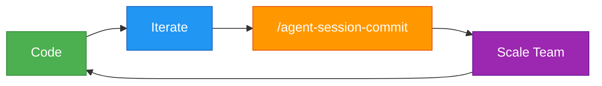
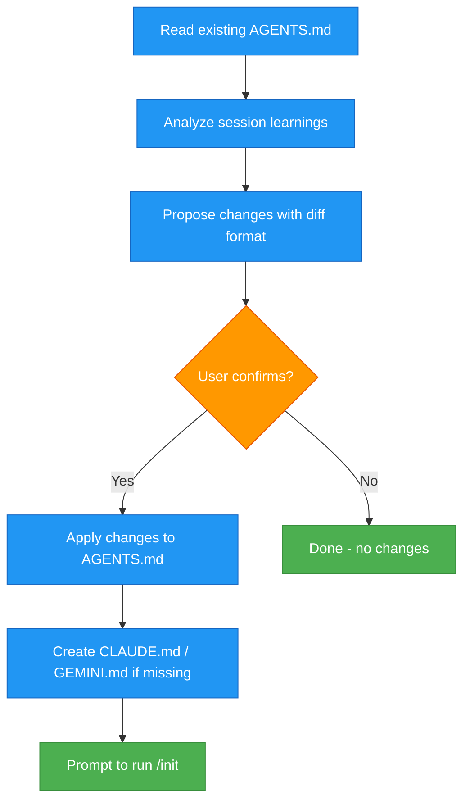

# Agent Session Commit <!-- omit in toc -->

**Scale your team, be it agents or humans by keep track of your team's patterns.**

`AGENTS.md` is the new source of truth for your repo's structure, best practices, decisions and taste.

Don't let details agent sessions go to waste. Commit them.



- [Quickstart](#quickstart)
  - [Installation](#installation)
  - [Usage](#usage)
  - [Uninstall](#uninstall)
- [Why This Exists](#why-this-exists)
- [What does this plugin do?](#what-does-this-plugin-do)
- [What Gets Captured](#what-gets-captured)
- [Star History](#star-history)

## Quickstart

### Installation

> [!NOTE]
> After installing, restart Claude Code for the plugin to take effect.

```bash
# Open claude
/claude

# Add the marketplace
/plugin marketplace add olshansk/agent-session-commit

# Install the plugin
/plugin install agent-session-commit@olshansk
```

**Update:**

```bash
/plugin update agent-session-commit@olshansk
```

**Auto-Update:** Run `/plugin` → Select Marketplaces → Choose olshansk → Enable auto-update

### Usage

Run this at the end of a coding session to capture what you learned or best practices you want to maintain for future sessions.

```bash
/agent-session-commit
```

### Uninstall

```bash
# Remove the plugin
/plugin uninstall agent-session-commit

# Remove the marketplace (optional)
/plugin marketplace remove olshansk
```

## Why This Exists

Every one of your claude sessions likely results in some best practice, pattern, or other tidbit of knowledge that you want to remember for future sessions.

The only to scale or team of human software engineers or fleet of agents is to disseminate best practices.

Best of all, we have `AGENTS.md` for this now!

## What does this plugin do?



## What Gets Captured

| Category     | Examples                                |
| ------------ | --------------------------------------- |
| Patterns     | Code style, naming conventions          |
| Architecture | Why things are structured a certain way |
| Gotchas      | Pitfalls discovered during development  |
| Debugging    | What to check when things break         |

## Star History

[](https://www.star-history.com/#Olshansk/agent-session-commit&type=date&legend=top-left)
