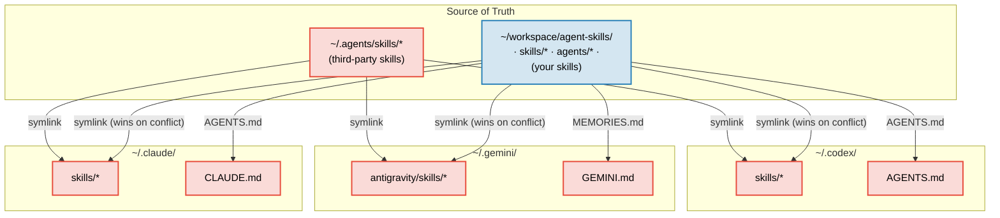
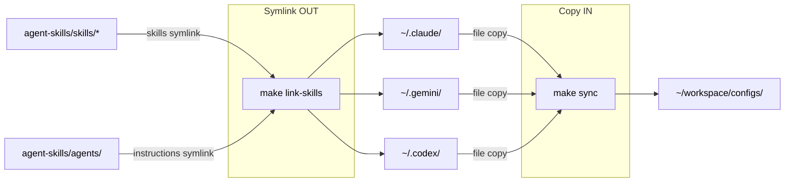

# agent-skills <!-- omit in toc -->

[](#)
[](#)
[](#)
[](#)
[](https://opensource.org/licenses/MIT)

> [!NOTE]
> My personal and public agent skills. [Olshansky.info](https://olshansky.info)

## What is this? <!-- omit in toc -->

- Olshansky's day-to-day agent skills
- Follows the [Agent Skills](https://agentskills.io/home) pattern for cross-tool skill distribution
- Inspired by [vercel-labs/agent-skills](https://github.com/vercel-labs/agent-skills)

## Table of Contents <!-- omit in toc -->

- [Quickstart](#quickstart)
- [Available Skills](#available-skills)
  - [Polished Skills](#polished-skills)
  - [Personal Skills (`cmd-*`)](#personal-skills-cmd-)
  - [3rd Party Skills](#3rd-party-skills)
- [Star History](#star-history)
- [Demo of `skills-dashboard`](#demo-of-skills-dashboard)
- [How It Works](#how-it-works)

## Quickstart

```bash
npx skills add olshansk/agent-skills
```

Then ask your agent to run any installed skill:

- _"resolve merge conflicts"_
- _"close the loop on this session"_
- _"idiot proof the documentation"_
- _"generate skills dashboard"_

> [!TIP]
> Start with [`session-commit`](skills/session-commit/SKILL.md) — it turns every coding session into durable knowledge by extracting patterns, decisions, and gotchas into your `AGENTS.md`. Future sessions (and future agents) pick up right where you left off.

## Available Skills

### Polished Skills

Skills I've polished for public use.

| Skill                                                  | What it does                                                  | Trigger examples                                           |
| ------------------------------------------------------ | ------------------------------------------------------------- | ---------------------------------------------------------- |
| [`session-commit`](skills/session-commit/SKILL.md)     | Captures session learnings and updates `AGENTS.md` safely     | "run session commit", "close the loop", "update AGENTS.md" |
| [`skills-dashboard`](skills/skills-dashboard/SKILL.md) | Scrapes skills.sh and generates an interactive HTML dashboard | "generate skills dashboard", "show skills ecosystem"       |

### Personal Skills (`cmd-*`)

Skills I use daily but might rename or delete in the future. I prefix them with `cmd-` so I can easily also leverage them as custom slash commands in claude code.

| Skill                                                                          | Description                                                                                   |
| ------------------------------------------------------------------------------ | --------------------------------------------------------------------------------------------- |
| [`cmd-chain-halt-code-reviewer`](skills/cmd-chain-halt-code-reviewer/SKILL.md) | Review protocol code for chain halt risks, non-determinism, and onchain behavior bugs         |
| [`cmd-codex-review-plan`](skills/cmd-codex-review-plan/SKILL.md)               | Get a second-opinion plan review from Codex (`codex exec`) before exiting plan mode           |
| [`cmd-email-md`](skills/cmd-email-md/SKILL.md)                                 | Convert markdown to email-safe HTML with inline styles and cross-client compatibility         |
| [`cmd-gh-issue`](skills/cmd-gh-issue/SKILL.md)                                 | Create structured GitHub issues from conversation context using `gh` CLI                      |
| [`cmd-idiot-proof-docs`](skills/cmd-idiot-proof-docs/SKILL.md)                 | Simplify documentation for clarity and scannability with approval-gated edits                 |
| [`cmd-local-repo-skills`](skills/cmd-local-repo-skills/SKILL.md)               | Scaffold cross-tool repo-local skills with canonical source in `.agents/skills/` and symlinks |
| [`cmd-olshanskify`](skills/cmd-olshanskify/SKILL.md)                           | Apply Olshansky's personal style to docs, code, blog posts, or presentations via templates    |
| [`cmd-persona`](skills/cmd-persona/SKILL.md)                                   | Prime the agent with a behavioral persona for the conversation                                |
| [`cmd-pr-build-context`](skills/cmd-pr-build-context/SKILL.md)                 | Build high-signal PR context with diff analysis, risk assessment, and discussion questions    |
| [`cmd-pr-conflict-resolver`](skills/cmd-pr-conflict-resolver/SKILL.md)         | Resolve merge conflicts with context-aware 3-tier classification and escalation               |
| [`cmd-pr-description`](skills/cmd-pr-description/SKILL.md)                     | Generate concise PR descriptions by analyzing the diff against a base branch                  |
| [`cmd-pr-gh-comments`](skills/cmd-pr-gh-comments/SKILL.md)                     | Holistically triage PR comments with line-range context, adjacent sweeps, approval-gated resolution, and cmd-olshanskify updates for @olshansk feedback |
| [`cmd-pr-review-prepare`](skills/cmd-pr-review-prepare/SKILL.md)               | Prepare branch for code review by building context and identifying issues                     |
| [`cmd-pr-edgecase`](skills/cmd-pr-edgecase/SKILL.md)                           | Review branch changes for test gaps, logic edge cases, and failure modes                      |
| [`cmd-pr-test-plan`](skills/cmd-pr-test-plan/SKILL.md)                         | Generate manual test plans with verified commands and pass/fail criteria                      |
| [`cmd-productionize`](skills/cmd-productionize/SKILL.md)                       | Transform apps into production-ready deployments with framework-specific optimization         |
| [`cmd-proofread`](skills/cmd-proofread/SKILL.md)                               | Proofread posts for spelling, grammar, repetition, logic, weak arguments, and broken links    |
| [`cmd-follow-up`](skills/cmd-follow-up/SKILL.md)                               | Post-implementation reflection — surface missed work, simplifications, and idiomatic fixes    |
| [`cmd-latest-msg`](skills/cmd-latest-msg/SKILL.md)                             | Store or retrieve the latest agent message to `/tmp/agents/{agent}/`                          |
| [`cmd-sculpt-code`](skills/cmd-sculpt-code/SKILL.md)                           | Reshape code for readability, naming, structure, TODOs, and reduced surface area              |
| [`cmd-rfc-review`](skills/cmd-rfc-review/SKILL.md)                             | Review RFCs for problem clarity, compliance, security, and performance using SCQA             |
| [`cmd-rss-feed-generator`](skills/cmd-rss-feed-generator/SKILL.md)             | Generate Python RSS feed scrapers with hourly GitHub Actions integration                      |
| [`cmd-scope-sweep`](skills/cmd-scope-sweep/SKILL.md)                           | Final pass to identify missed items, edge cases, and risks before closing scope               |
| [`makefile`](skills/makefile/SKILL.md)                                         | Create or improve Makefiles with templates (python-uv, fastapi, nodejs, go, flutter)          |
| [`mermaid-render`](skills/mermaid-render/SKILL.md)                             | Render and display Mermaid diagrams inline in iTerm2 or Ghostty                               |

### 3rd Party Skills

Skills installed from other publishers via `npx skills add`. These live in `~/.agents/skills/` and are not authored in this repo. Regenerate this table with `make sync-external-skills`.

<!-- BEGIN: 3rd-party-skills -->

| Skill | Description |
| ----- | ----------- |
| `cmd-clean-code` | Improve code readability without altering functionality using idiomatic best practices |
| `cmd-code-cleanup` | Remove dead code and duplication pragmatically with a 5-phase systematic approach |
| `cmd-pr-sweep` | Review changes for test gaps, simplification, naming consistency, reuse opportunities, and TODO quality |
| `cmd-python-stylizer` | Analyze Python code for style improvements including naming, structure, nesting, and cognitive load reduction |
| `cmd-rss-feed-generator` | Generate Python RSS feed scrapers from blog websites, integrated with hourly GitHub Actions |
| `find-skills` | Helps users discover and install agent skills when they ask questions like "how do I do X", "find a skill for X", "is there a skill that can...", or express interest in extending capabilities. This skill should be used when the user is looking for functionality that might exist as an installable skill. |
| `grove` | Grove is a wallet-first, agent-friendly Linktree that helps creators earn revenue from high-quality content online. Covers wallet setup, identity/handle registration, creator discovery, crypto tipping, paid messaging (Tip to Talk), content feed discovery, stream alerts, and earning. Use when the user wants to tip, pay, message, or attribute value to a creator, set up a web3 profile, discover content, or monetize content and attention. |
| `gstack` | Fast headless browser for QA testing and site dogfooding. Navigate any URL, interact with elements, verify page state, diff before/after actions, take annotated screenshots, check responsive layouts, test forms and uploads, handle dialogs, and assert element states. ~100ms per command. Use when you need to test a feature, verify a deployment, dogfood a user flow, or file a bug with evidence. |
| `macos-design-guidelines` | Apple Human Interface Guidelines for Mac. Use when building macOS apps with SwiftUI or AppKit, implementing menu bars, toolbars, window management, or keyboard shortcuts. Triggers on tasks involving Mac UI, desktop apps, or Mac Catalyst. |
| `native-app-performance` | Native macOS/iOS app performance profiling via xctrace/Time Profiler and CLI-only analysis of Instruments traces. Use when asked to profile, attach, record, or analyze Instruments .trace files, find hotspots, or optimize native app performance without opening Instruments UI. |
| `skill-creator` | Create new skills, modify and improve existing skills, and measure skill performance. Use when users want to create a skill from scratch, update or optimize an existing skill, run evals to test a skill, benchmark skill performance with variance analysis, or optimize a skill's description for better triggering accuracy. |
| `swift-accessibility` | Automatically applies accessibility best practices to Swift projects (SwiftUI and UIKit). Use when working on iOS/macOS projects that need VoiceOver support, Dynamic Type, WCAG compliance, or accessibility audits. Triggers on Swift accessibility tasks, a11y improvements, or when the user mentions accessibility, VoiceOver, or Dynamic Type. |
| `swiftui-developer` | Develop SwiftUI applications for iOS/macOS. Use when writing SwiftUI views, managing state, or building Apple platform UIs. |
| `vercel-composition-patterns` | React composition patterns that scale. Use when refactoring components with boolean prop proliferation, building flexible component libraries, or designing reusable APIs. Triggers on tasks involving compound components, render props, context providers, or component architecture. Includes React 19 API changes. |
| `vercel-react-best-practices` | React and Next.js performance optimization guidelines from Vercel Engineering. This skill should be used when writing, reviewing, or refactoring React/Next.js code to ensure optimal performance patterns. Triggers on tasks involving React components, Next.js pages, data fetching, bundle optimization, or performance improvements. |
| `vercel-react-native-skills` | React Native and Expo best practices for building performant mobile apps. Use when building React Native components, optimizing list performance, implementing animations, or working with native modules. Triggers on tasks involving React Native, Expo, mobile performance, or native platform APIs. |
| `web-design-guidelines` | Review UI code for Web Interface Guidelines compliance. Use when asked to "review my UI", "check accessibility", "audit design", "review UX", or "check my site against best practices". |
| `xcode-build` | Build and run iOS/macOS apps using xcodebuild and xcrun simctl directly. Use when building Xcode projects, running iOS simulators, managing devices, compiling Swift code, running UI tests, or automating iOS app interactions. Replaces XcodeBuildMCP with native CLI tools. |

<!-- END: 3rd-party-skills -->

## Star History

[](https://www.star-history.com/#olshansk/agent-skills&type=date&legend=top-left)

## Demo of `skills-dashboard`

A live dashboard of the skills.sh ecosystem is available at **[skills-dashboard.olshansky.info](https://skills-dashboard.olshansky.info/)**.

It shows publisher distribution, install counts, top skills, and the long-tail power law of adoption. Regenerate it yourself with the `skills-dashboard` skill.


## How It Works

### Symlink Architecture <!-- omit in toc -->

Two sources of truth feed into every tool's skills directory:



| Skill type      | Source of truth       | Installed via      | Symlink target                      |
| --------------- | --------------------- | ------------------ | ----------------------------------- |
| **Your skills** | `skills/` (this repo) | `make link-skills` | `~/workspace/agent-skills/skills/*` |
| **Third-party** | `~/.agents/skills/`   | `npx skills add`   | `~/.agents/skills/*`                |

### Makefile Workflows <!-- omit in toc -->



| Target             | Description                                                      |
| ------------------ | ---------------------------------------------------------------- |
| `make link-skills` | Symlink repo + third-party skills into Claude, Gemini, and Codex |
| `make list-skills` | List all skills with descriptions                                |
| `make sync`        | Backup tool configs into `~/workspace/configs/`                  |
| `make test`        | Validate skill frontmatter and repo consistency                  |

### After `npx skills add` <!-- omit in toc -->

`npx skills add` installs third-party skills into `~/.agents/skills/` and creates symlinks in `~/.claude/skills/`. Running `make link-skills` afterward restores your repo skills (which take precedence on name conflicts) and extends third-party skills to Codex and Gemini.
