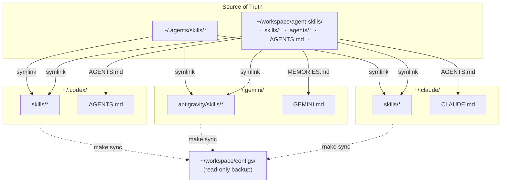
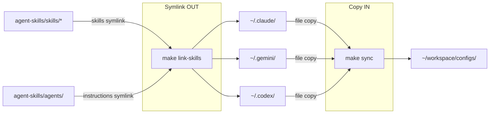
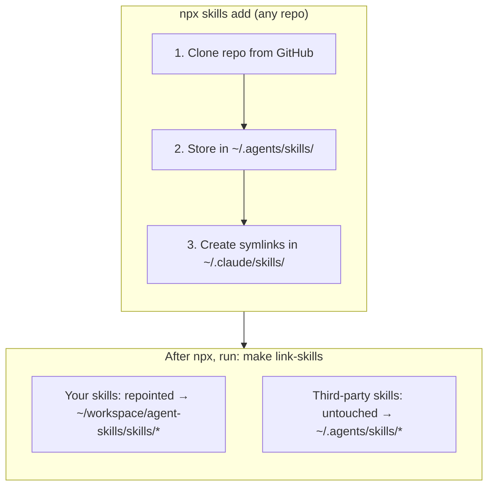

# Agent Skills <!-- omit in toc -->

Reusable skills for Claude Code, Gemini, and Codex.

- [Architecture](#architecture)
- [Symlink Map](#symlink-map)
- [Makefile Workflows](#makefile-workflows)
- [npx Install \& Coexistence](#npx-install--coexistence)
- [Makefile Targets](#makefile-targets)

## Architecture

This repo and one third-party directory work together:

| Location                                       | What it holds                                     | Role                           |
| ---------------------------------------------- | ------------------------------------------------- | ------------------------------ |
| `~/workspace/agent-skills/` (this repo)        | Skills (`skills/`), agent instructions (`agents/`) | **Source-of-truth**            |
| `~/.agents/skills/`                            | Third-party skills (find-skills, vercel-\*, etc.) | Managed by `npx skills add`    |
| `~/workspace/agent-skills/personal/configs/`   | Snapshots of tool configs                         | Read-only backup               |

## Symlink Map

## Makefile Workflows

- **`make link-skills`** symlinks skills and agent instructions FROM this repo INTO all tool dirs (Claude, Gemini, Codex)
- **`make sync`** copies FROM tool dirs INTO `~/workspace/configs/` (one-way backup for git history)

## npx Install & Coexistence

| Skill type | Source of truth | Installed via | Symlink target |
|---|---|---|---|
| **Your skills** | this repo | `make link-skills` | `~/workspace/agent-skills/skills/*` |
| **Third-party** | `~/.agents/skills/` | `npx skills add` | `~/.agents/skills/*` |

- `npx skills add` and `make link-skills` both write to `~/.claude/skills/` — whichever runs last wins for overlapping names
- **In practice**: run `npx skills add` for third-party skills, then `make link-skills` to restore yours
- This works because `make link-skills` only creates symlinks for skills that exist in your repo — third-party skills are left alone

## Makefile Targets

| Target             | Description                                                                  |
| ------------------ | ---------------------------------------------------------------------------- |
| `make link-skills` | Symlink repo skills into Claude, Gemini, and Codex (repoints if needed)      |
| `make list-skills` | List all skills with descriptions                                            |
| `make sync`        | Backup all tool configs into `personal/configs/`                             |
| `make test`        | Validate skill frontmatter and repo consistency                              |
| `make status`      | Show repository status                                                       |
