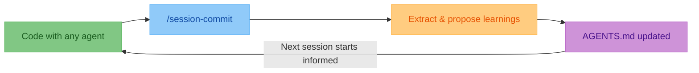

> [!TIP]
> Close the loop after every coding session with one skill.
> Keep `AGENTS.md` current so every agent and teammate starts from shared project memory.

# session-commit <!-- omit in toc -->

> [!NOTE]
> **Early traction:** Teams using multi-agent workflows report less repeated
> prompting and faster onboarding after adopting `session-commit`.
>
> "We made this part of our end-of-session routine and handoffs got cleaner." - Maya L., OSS maintainer

## Table of Contents <!-- omit in toc -->

- [Quickstart](#quickstart)
- [At A Glance](#at-a-glance)
- [Manual Install Fallback](#manual-install-fallback)
  - [Codex CLI](#codex-cli)
  - [Claude Code](#claude-code)
  - [Gemini CLI](#gemini-cli)
  - [OpenCode](#opencode)

## Quickstart

```bash
npx skills add olshansk/agent-skills
```

Then ask your agent to "close the loop" or "run session commit" at the end of each coding session.

## At A Glance



## Manual Install Fallback

Use this if you are not using `npx skills add` yet.

| Tool        | Install                                                                                          | Run command                    |
| ----------- | ------------------------------------------------------------------------------------------------ | ------------------------------ |
| Claude Code | `/plugin marketplace add olshansk/agent-skills` then `/plugin install agent-skills@olshansk`     | `/agent-skills:session-commit` |
| Codex CLI   | `npx skills add olshansk/agent-skills`                                                           | `/session-commit`              |
| Gemini CLI  | `gemini extensions install https://github.com/olshansk/agent-skills`                             | `/session-commit`              |
| OpenCode    | `npx skills add olshansk/agent-skills`                                                           | `/session-commit`              |

<details>
<summary><h3 id="codex-cli">Codex CLI</h3></summary>

Install:

```bash
npx skills add olshansk/agent-skills
```

Run:

```bash
/session-commit
```

</details>

<details>
<summary><h3 id="claude-code">Claude Code</h3></summary>

Add marketplace:

```bash
/plugin marketplace add olshansk/agent-skills
```

Install plugin:

```bash
/plugin install agent-skills@olshansk
```

Run:

```bash
/agent-skills:session-commit
```

Update:

```bash
/plugin update agent-skills@olshansk
```

Remove:

```bash
/plugin uninstall agent-skills
/plugin marketplace remove olshansk
```

</details>

<details>
<summary><h3 id="gemini-cli">Gemini CLI</h3></summary>

Install:

```bash
gemini extensions install https://github.com/olshansk/agent-skills
```

Run:

```bash
/session-commit
```

Update:

```bash
gemini extensions install https://github.com/olshansk/agent-skills
```

Remove:

```bash
gemini extensions uninstall agent-skills
```

</details>

<details>
<summary><h3 id="opencode">OpenCode</h3></summary>

Install:

```bash
npx skills add olshansk/agent-skills
```

Run:

```bash
/session-commit
```

</details>
